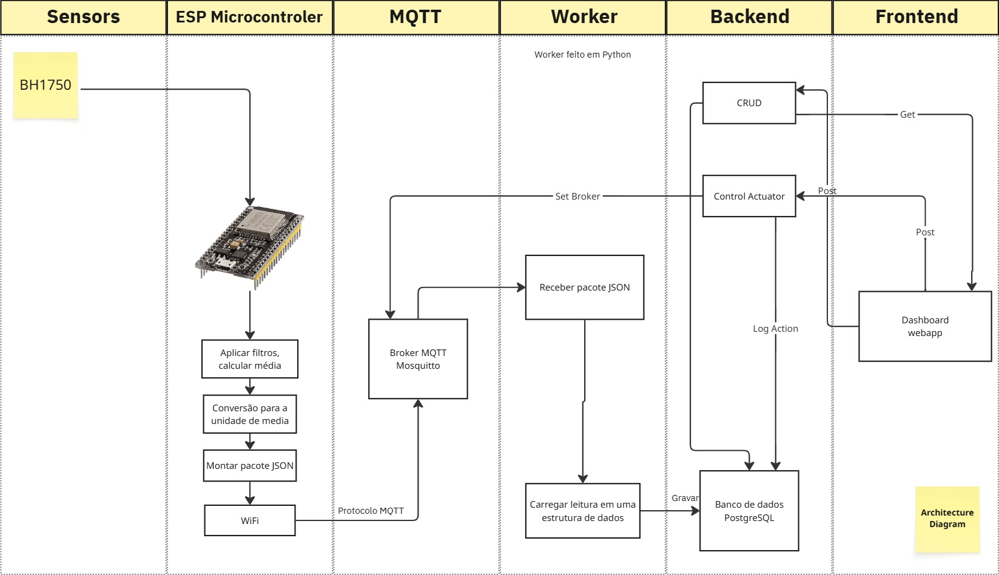
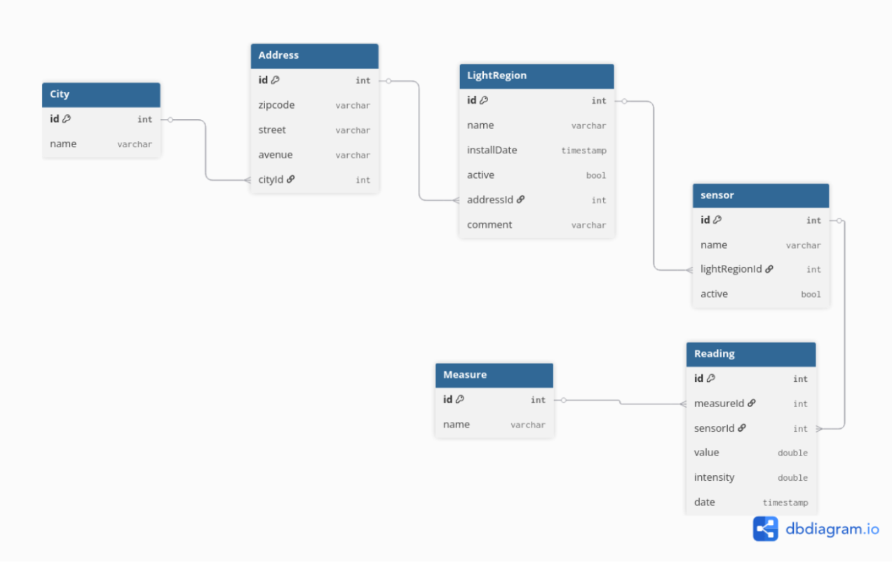
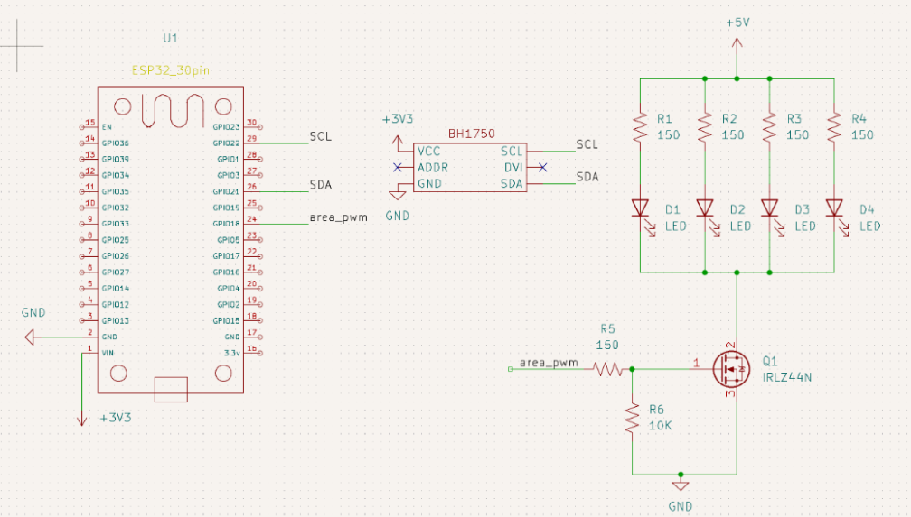
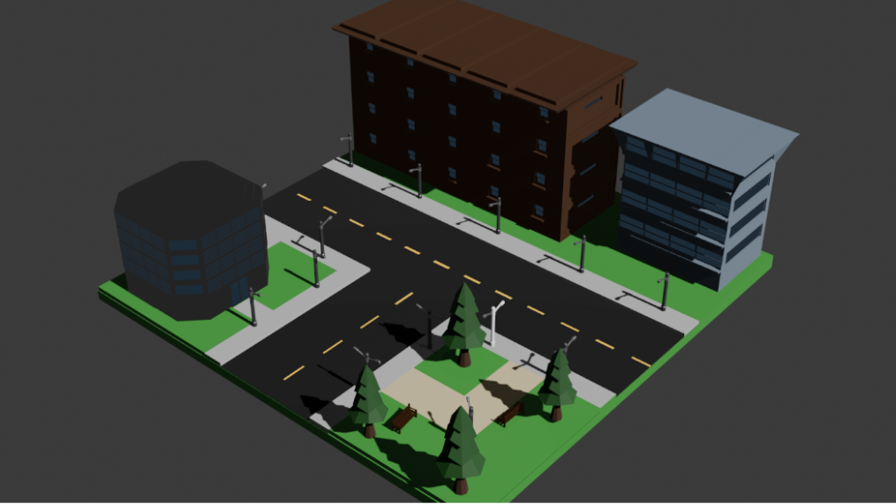

# Architecture Diagram

# Entity Relational Diagram (ERD)

# Hardware Diagram

# Prototype Model Diagram

# Requirements

## 📌 Requisitos Funcionais

- **RF001 - Monitoramento de Luminosidade**
  - Observar a luminosidade na rua com o sensor BH1750
  - Squad: Hardware Team

- **RF002 - Monitoramento de Presença**
  - Reduzir ou eliminar iluminação de áreas sem pessoas
  - Squad: Hardware Team

- **RF003 - Coleção de dados em tempo real**
  - Manter o backend informado com dados atuais
  - Squad: Hardware Team

- **RF004 - Tratamento de dados em borda**
  - Enviar ao backend o sinal já processado como unidade de medida (lux)
  - Squad: Hardware/Software Team

- **RF005 - Inserção de dados tratados no banco**
  - Receber dados via MQTTS e armazená-los no PostgreSQL
  - Squad: Software Backend Team

- **RF006 - Modelagem do banco**
  - Definir as tabelas e relações do banco de dados
  - Squad: DBA Team

- **RF007 - Consumo dos dados inseridos no banco**
  - Fornecer os dados do banco para o frontend
  - Squad: Backend Team

- **RF008 - Métricas estatísticas**
  - Gerar métricas e análises a partir dos dados coletados
  - Squad: Business/Backend Team

- **RF009 - Frontend Dashboard**
  - Desenvolver interface visual para exibição dos dados
  - Squad: Frontend Team

- **RF010 - Controle manual de luminosidade via dashboard**
  - Definir setpoint de luminosidade para cada área pelo frontend
  - Squad: Backend/Frontend Team

- **RF011 - Configuração automática da rotina do sensor via interface**
  - Permitir configuração automatizada dos sensores via interface
  - Squad: Backend/Frontend Team

- **RF012 - Montagem do esquema elétrico dos LEDs**
  - Desenvolver o circuito elétrico dos LEDs do sistema
  - Squad: Hardware Team

- **RF013 - Protótipo 3D da maquete**
  - Desenvolver e montar o protótipo físico em 3D
  - Squad: Hardware/Engineer Team

## ⚙️ Requisitos Não Funcionais

- **NFR001 - Suporte a acessos simultâneos**
  - O sistema deve suportar múltiplas áreas enviando dados simultaneamente
  - Squad: Backend Team

- **NFR002 - Tolerância à queda de energia (buffer de dados)**
  - Dados devem ser armazenados em memória flash em caso de falha de energia
  - Squad: Hardware/Backend Team
